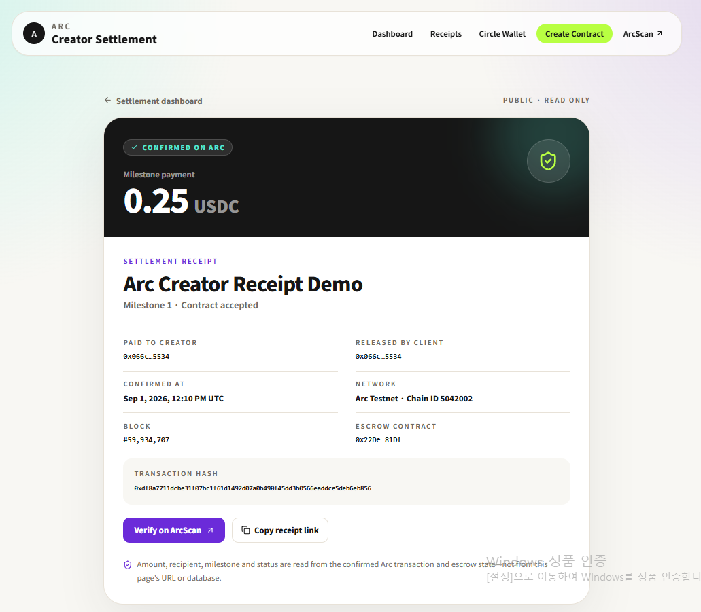

# Arc Creator Settlement v0.3

**Verifiable USDC milestone settlement on Arc for creators, freelancers, and marketplaces.**

Arc Creator Settlement turns a project agreement into a USDC-funded escrow. A creator submits a milestone, the client releases payment, and v0.3 turns that release transaction into a public onchain receipt that anyone can verify without connecting a wallet.

## What v0.3 adds

- Public receipt route: `/receipt/<Arc transaction hash>`
- Independent verification of transaction success, `PaymentReleased` event data, and escrow state at the confirmed block
- Human-readable project, milestone, creator, amount, block, timestamp, and ArcScan proof
- Exact release-event tracking for browser wallets and Circle wallet challenges
- Recent receipt history with local fallback
- Optional Supabase index that accepts only receipts re-verified by the server
- Responsive navigation, live Arc network status, loading/error states, and copyable receipt links

The transaction hash is only the lookup key. Amount, creator, milestone, and project data are reconstructed from Arc RPC and the escrow contract; query strings and browser storage are never treated as proof.

## Live Arc Testnet proof

- Product: https://arc-creator-settlement-v0-2.vercel.app
- EscrowFactory: [`0x5b90cdfecf1c59596e0b6b9cae448a29c2774e32`](https://testnet.arcscan.app/address/0x5b90cdfecf1c59596e0b6b9cae448a29c2774e32)
- Demo escrow: [`0x22De463e9969b8Cef07b151b9cB5D8c5A16D81Df`](https://testnet.arcscan.app/address/0x22De463e9969b8Cef07b151b9cB5D8c5A16D81Df)
- Confirmed 0.25 USDC release: [`0xdf8a7711dcbe31f07bc1f61d1492d07a0b490f45dd3b0566eaddce5deb6eb856`](https://testnet.arcscan.app/tx/0xdf8a7711dcbe31f07bc1f61d1492d07a0b490f45dd3b0566eaddce5deb6eb856)
- Public receipt: https://arc-creator-settlement-v0-2.vercel.app/receipt/0xdf8a7711dcbe31f07bc1f61d1492d07a0b490f45dd3b0566eaddce5deb6eb856



The receipt and ArcScan independently agree on the transaction hash, block `59,934,707`, escrow, creator, and `0.25 USDC` transfer. The flow used Circle User-Controlled Wallets for approval, Circle Contracts for factory deployment, and Arc Testnet USDC for escrow funding and release.

## Settlement flow

1. Create a project with a creator address and USDC milestones.
2. Fund the escrow with USDC on Arc Testnet.
3. The creator submits completed work.
4. The client calls `approveAndRelease()`.
5. The escrow transfers USDC and emits `PaymentReleased`.
6. The app waits for the exact confirmed event, then creates a shareable receipt URL.
7. Opening the receipt re-verifies the transaction and contract state against Arc.

## Included stack

- Next.js 15, React 19, TypeScript, Tailwind CSS
- Solidity `MilestoneEscrow` and `EscrowFactory`
- viem Arc RPC reads and browser-wallet transactions
- Circle User-Controlled and Developer-Controlled Wallet flows
- Circle Contracts deployment script
- Optional Supabase receipt index with RLS
- Hardhat contract tests and Node/React receipt tests

## Quick start

```bash
npm install
copy .env.example .env.local
npm run dev
```

On macOS/Linux, use `cp .env.example .env.local`. Open `http://localhost:3000`.

No API key, entity secret, private key, or recovery file is included. See [`SETUP_NEXT_STEPS_KR.md`](SETUP_NEXT_STEPS_KR.md) for the exact Arc/Circle setup and deployment sequence.

## Optional receipt index

Receipts work without a database. To show a shared recent-receipts feed:

1. Run `supabase/schema.sql` in your Supabase project.
2. Set `SUPABASE_URL` and server-only `SUPABASE_SECRET_KEY`.
3. Never prefix the secret with `NEXT_PUBLIC_`.

The public can read indexed receipts, but only the server can write, and the server verifies Arc data before every upsert.

## Verification

```bash
npm run test
npm run test:web
npm run build
```

## Public evidence

The Vercel product, factory, funded escrow, release transaction, receipt, and matching ArcScan capture are now public. A short demo video remains optional follow-up evidence.

Use [`docs/discord-application-evidence.md`](docs/discord-application-evidence.md) and [`docs/submission-checklist.md`](docs/submission-checklist.md). Keep every undeployed item marked as pending; this repository intentionally does not fabricate usage, traction, or integrations.

## Project documents

- `docs/architecture.md`
- `docs/demo-video-script.md`
- `docs/grant-application.md`
- `docs/technical-roadmap.md`
- `docs/submission-checklist.md`
- `docs/discord-application-evidence.md`
- `Arc_Creator_Settlement_Pitch_Deck.pptx`
