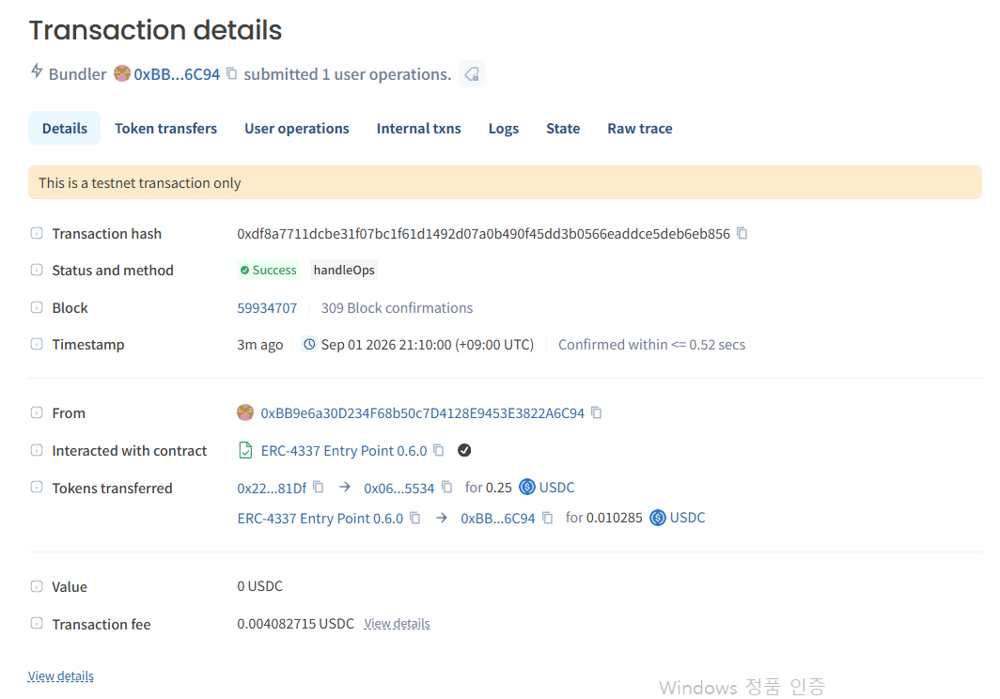

# Arc Creator Settlement v0.3 — Verified Progress Update

Date: 2026-09-01  
Network: Arc Testnet (`5042002`)

Arc Creator Settlement v0.3 is now deployed and has completed a real testnet settlement flow using Circle Wallets, Circle Contracts, and USDC. A Circle User-Controlled Wallet created a milestone escrow, approved and deposited USDC, submitted a milestone, and released `0.25 USDC`. The app generated a public read-only receipt from the confirmed `PaymentReleased` event and escrow state.

## Public proof

- Live product: https://arc-creator-settlement-v0-2.vercel.app
- EscrowFactory: https://testnet.arcscan.app/address/0x5b90cdfecf1c59596e0b6b9cae448a29c2774e32
- Demo escrow: https://testnet.arcscan.app/address/0x22De463e9969b8Cef07b151b9cB5D8c5A16D81Df
- Release transaction: https://testnet.arcscan.app/tx/0xdf8a7711dcbe31f07bc1f61d1492d07a0b490f45dd3b0566eaddce5deb6eb856
- Public receipt: https://arc-creator-settlement-v0-2.vercel.app/receipt/0xdf8a7711dcbe31f07bc1f61d1492d07a0b490f45dd3b0566eaddce5deb6eb856

## Verified facts

- Transaction status: success
- Block: `59,934,707`
- Milestone: `1 — Contract accepted`
- Released amount: `0.25 USDC`
- Creator: `0x066c22504a9281811368A4BB942bAd72659C5534`
- Escrow: `0x22De463e9969b8Cef07b151b9cB5D8c5A16D81Df`
- Public receipt loads without a connected wallet
- Receipt facts are reconstructed from Arc RPC data and contract state

## Evidence images

This update reports testnet product progress only. It does not claim mainnet launch, production customers, or traction that has not been independently verified.
